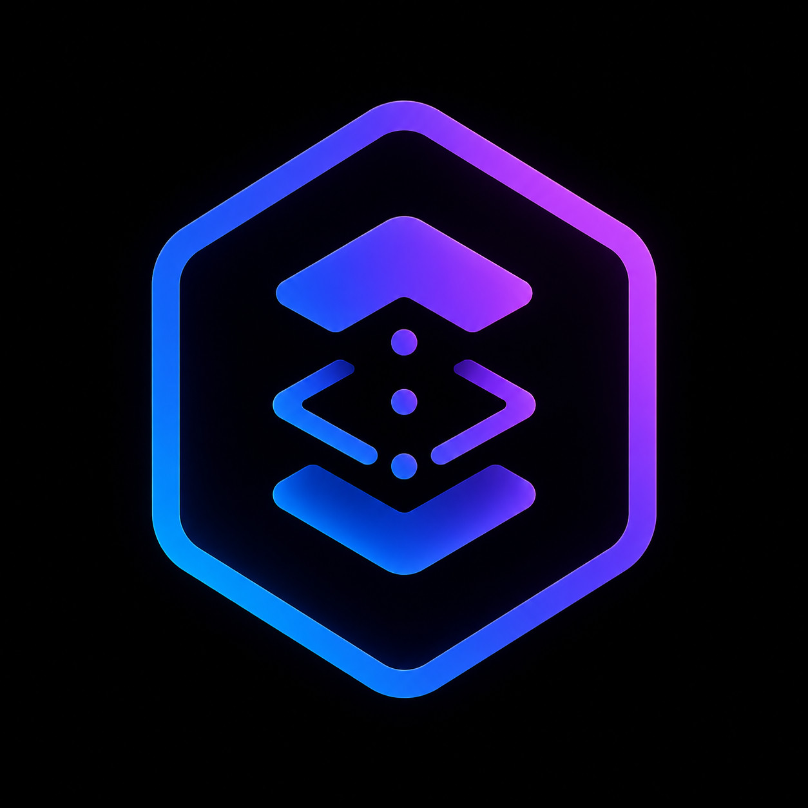

<p align="center">
  
</p>

<h1 align="center">TAI</h1>

<p align="center">Ship your AI tooling as code.</p>

---

TAI is a CLI that turns a git repo into the source of truth for your AI tooling. Skills, commands, and agents get installed into whatever directory your AI tool reads from. Workflows and standards live in the same repo and are read on demand. You point TAI at the repo, run `tai sync`, and your AI tool picks up exactly what the maintainer wanted you to have.

TAI is agnostic to the AI tool you use. If it loads its assets from a directory on disk, TAI can put them there. Claude Code and OpenCode are the obvious fits today; anything that follows the "files in a known folder" pattern works the same way. You configure the target paths once; TAI does the rest.

If you've been pasting skills into Slack, reinventing multi-step processes every quarter because nobody remembered the sequence, or pasting the same team standards into prompts over and over, this is for you.

## The problem

You write a useful skill for your AI tool. You drop it in a Slack channel. Three months later half the team is on a stale version, one engineer improved it locally and never told anyone, two new hires never got the link.

Now multiply the problem. You also figured out a great three-step process for proposing a change: grill the idea, draft an OpenSpec, then TDD it. Nobody else on the team remembers it. They each reinvent it badly. And your team has a real standard for estimating work, but it lives in a Notion page the AI can't see, so every prompt re-explains it.

Your project code has git, code review, and a deploy story. Your AI tooling, including the skills, the processes, and the conventions, has a Slack thread and a hope that everyone refreshes it.

TAI fixes the second one. It treats all of your AI tooling the same way you treat your code: a repo, reviewed changes, versioned releases, and a CLI that makes sure every developer's machine catches up.

## How it works (30 seconds)

1. A **maintainer** (you, your team lead, or someone whose stack you like) creates a git repo with a fixed structure: `skills/`, `commands/`, `agents/`, `workflows/`, `standards/`, `plugins.yml`.
2. Every **subscriber** runs `tai config set repo-url <url>` once, then `tai sync`.
3. TAI clones the repo, copies skills/commands/agents into the directories the AI tool already reads (e.g. `~/.claude/skills/`), and tracks what it installed.
4. Workflows and standards stay in the local clone and are exposed via `tai workflow run <name>` and `tai standards load <name>`. A skill or human asks for them; TAI emits the content for the AI to act on.
5. TAI polls the upstream in the background. When a change shows up (new TAI release, plugin update, or new commits on the source repo's main), it surfaces a one-line banner at most once a day. Run `tai sync` to pull source-repo changes.

That's the whole product. No SaaS in the middle. No proprietary store. No abstraction layer. The on-disk format for what gets installed is whatever your AI tool already understands.

## Why TAI (and not something else)

A few honest comparisons.

**Why not just commit a `.claude/` folder to your project repo?** Do that if your assets are project-specific. TAI exists for the global slice: skills you want available on every project, not just the one you're in.

**Why not a dotfiles repo, or a manager like chezmoi?** Dotfiles managers handle the file-distribution part well; chezmoi in particular has overwrite detection, templating, and update notifications. What none of them give you is a purpose-built model for AI tooling: the workflow runner, the standards loader, the plugin namespace contract, and a source-repo layout your AI tool can consume directly. TAI is what you'd end up building on top of chezmoi for AI tooling specifically.

**Why not a SaaS that manages this for you?** Because then your AI assets live in someone else's database. With TAI, your assets are normal files in a normal git repo, readable by your AI tool with or without TAI present. The day you stop using TAI, you lose nothing.

**Why not wait for Anthropic / Cursor / whoever to ship this themselves?** Maybe they will. Until then, this works today, on the layout those tools already use. If they ship something better, you can stop using TAI and your files keep working.

## What TAI is NOT trying to do

- LLM infrastructure. No gateways, no prompt vaults, no eval harnesses, no observability. There are good tools for that and TAI is not one of them.
- Per-project AI assets. `git clone` already syncs those with the project. TAI is for the global layer.
- A skills marketplace, or any source-repo discovery surface. Plugins resolve by explicit source. Source repos are found via blog posts and word of mouth, not via TAI.
- Outbound notification integrations (Slack, email, webhooks). The update banner is a pull model; TAI does not push.
- Real-time collaboration. No shared sessions, no chat, no presence. TAI is distribution, not collaboration.
- Generic dotfile syncing. Use chezmoi or yadm. TAI is scoped to AI tooling.

Full version in [`docs/NORTHSTAR.md`](docs/NORTHSTAR.md).

## Quick start

```bash
# install (the way you'd install any Go CLI for now; release channels TBD)
go install github.com/dmastrorillo/tai/core/cmd/tai@latest

# point at one or more target directories (where your AI tool reads from)
tai config target add ~/.claude       # example: Claude Code
# tai config target add ~/.opencode   # example: OpenCode
# tai config target add ~/.your-tool  # anything that reads files from a directory

# point at a source repo
tai config set repo-url git@github.com:your-team/ai-as-code.git

# pull it down
tai sync
```

You're now in sync with the repo. Run `tai sync` again any time the upstream changes (or wait for the once-per-day banner to nag you).

## Starting your own source repo

If you don't have one yet, scaffold one:

```bash
tai repo init ./my-ai-stack
cd my-ai-stack
# add a real remote
git remote add origin git@github.com:you/my-ai-stack.git
git push -u origin main
```

The scaffold drops a templated layout with READMEs in every folder explaining the rules. Put your skills in `skills/`, your commands in `commands/`, your agents in `agents/`. Push. Now anyone with `tai config set repo-url ...` is your subscriber.

## Concepts

### Source repo

A normal git repo with a templated structure. Maintained the way you maintain code: branches, reviews, releases, the works. There's nothing proprietary about it. You could `cat` every file and the AI tool would still understand it.

### Target

A directory on a subscriber's machine where TAI writes assets. There is no built-in default; you tell TAI where your AI tool reads from. Common choices are `~/.claude` (Claude Code), `~/.opencode` (OpenCode), or any other folder your AI tool uses. You can configure more than one target; TAI fans out to all of them.

You can also remap subdirectories per target if your AI tool puts things in different places:

```yaml
targets:
  - root: ~/.claude          # all defaults: skills/, commands/, agents/
  - root: ~/.opencode
    skills: ""                # falsy = skip this category for this target
    agents: rules             # custom subdirectory name
```

### Workflows

YAML files in the source repo's `workflows/` directory. A workflow is an ordered series of skills and commands that compose into a larger task. Example: `grill-with-docs` then `openspec:propose` then `tdd-loop`. Agents are never workflow steps; they get reached transitively from inside a skill or command. Run a workflow by name:

```bash
tai workflow list
tai workflow run propose
```

The output is a markdown plan for the AI to follow, not an executable script. TAI tells your AI what to do; the AI does it. The plan includes a "Failure mode" section instructing the AI to abort if any required skill or command is missing from its session. TAI itself does not enforce that check (it cannot see what is loaded in the AI's session); the AI does.

### Standards

Markdown documents in `standards/`. Team conventions, security baselines, estimation guidelines, whatever you want your AI to consult before doing certain kinds of work. Standards are not synced to your AI tool's folder; they're lazy-loaded when something points at them:

```bash
tai standards list
tai standards load devops:security:best-practices
```

A skill or workflow can say "before estimating, run `tai standards load ...` and follow it." That's how standards travel.

### Plugins

The bit where TAI gets opinionated. A plugin is a standalone executable plus assets. It adds its own top-level verb (`tai triage import`, for example), can ship its own SQLite database, can enforce its own conventions. Plugin assets are namespaced (`tai-<plugin>-*`) so they can never collide with user-authored content. Updates blindly overwrite the namespace.

```bash
tai plugins triage install     # install first-party plugin (resolves via TAI's built-in registry)
tai plugins list               # see what's installed
tai plugins triage update      # update to the latest available version
                               # (uses the source recorded at install time;
                               #  does not take --source or --version itself)
```

First-party plugins resolve by short name. Third-party plugins resolve by explicit source. Two equivalent forms:

```bash
tai plugins acme-custom install --source github.com/acme/tai-plugin-custom --version v1.0.0
# or, embedding the version in the source:
tai plugins acme-custom install --source github.com/acme/tai-plugin-custom@v1.0.0
```

There is no marketplace, no registry beyond the small hard-coded list of first-party names, no central index, no source-repo browser.

## CLI reference

```text
tai config show                              show current config
tai config edit                              open config in $EDITOR
tai config set <key> <value>                 set scalar top-level keys
tai config target add <root> [--skills X] [--commands Y] [--agents Z]
tai config target list
tai config target remove <root>

tai sync [--prune] [-y]                      pull source repo, copy assets
tai repo init <path>                         scaffold a new source repo
tai install-commands                         install TAI's built-in slash commands

tai workflow list
tai workflow run <name>

tai standards list
tai standards load <name>

tai plugins list
tai plugins <name> install [--source X --version Y]
tai plugins <name> update
tai plugins <name> remove

tai <plugin-name> <subcommand...>            run a plugin's commands
tai --help
tai --version
```

Every command writes data to stdout, conversation to stderr, errors via a predictable template ending in `[exit <N>: <ERROR_CODE>]`. Error codes are stable and append-only; once shipped they never get renamed. Plugins follow the same contract.

## Authoring a plugin

A plugin is a binary that TAI runs as a subprocess. TAI passes context via environment variables:

- `TAI_CLONE_DIR`: path to the local clone of the source repo (empty if none).
- `TAI_TARGETS`: JSON array of configured targets.
- `TAI_DATA_DIR`: where TAI stores state. Your plugin's state goes under `<TAI_DATA_DIR>/plugins/<your-name>/`.

Any language works as long as it produces an executable. Go authors get an SDK at `github.com/dmastrorillo/tai/pkg/taiplugin` that parses the env vars and re-exports the error template helpers, so your plugin's errors look identical to TAI's own.

Asset rules:

- Skills in `assets/skills/` must be named `tai-<your-plugin>-*`.
- Agents in `assets/agents/` must be named `tai-<your-plugin>-*`.
- Commands in `assets/commands/` can be named anything; TAI puts them under `<target>/<commands>/tai-<your-plugin>/`.

The naming scoping means plugins can overwrite freely within their namespace without prompting, and they cannot collide with the subscriber's own content. If a subscriber wants to customize a plugin asset, they copy it under a non-`tai-*` name (which removes it from the plugin's reach).

## The name

Pronounced like the "Thai" in "Thailand". Rhymes with "tie".

It started as **Triage AI**, a small CLI for triaging PR review comments with an LLM. It worked. The name stuck. While building it we hit a different itch: there was no clean way to make sure every developer on a team had the same AI-tool setup. We built something for that. The Triage AI feature becomes the first **plugin** that ships on top.

The name doesn't stand for anything anymore. The CLI binary is `tai` (lowercase, monospace). The project is TAI (uppercase, prose).

## Project layout

```
core/                       the `tai` CLI
plugins/<name>/             first-party plugins (currently `triage`)
pkg/                        public Go API: errcode, cliout, exitcode, cliexec
openspec/                   proposal-driven design history
core/test-cases.md          BDD spec for core CLI
pkg/test-cases.md           BDD spec for the shared framework (pkg/)
plugins/<name>/test-cases.md  BDD spec per plugin
docs/NORTHSTAR.md           what this product is and is not
CONTEXT.md                  glossary
CLAUDE.md                   contributor pipeline (OpenSpec → BDD → TDD)
```

Quick links: [`CONTEXT.md`](CONTEXT.md), [`CLAUDE.md`](CLAUDE.md), [`docs/NORTHSTAR.md`](docs/NORTHSTAR.md), [`openspec/`](openspec/).

Every behaviour change starts as an OpenSpec proposal, gets translated to Given/When/Then in the right `test-cases.md`, and lands behind a failing test before any production code is written. The discipline is documented in [`CLAUDE.md`](CLAUDE.md).

## Contributing

See [`CONTRIBUTING.md`](CONTRIBUTING.md) for the full guide. The short version: read [`docs/NORTHSTAR.md`](docs/NORTHSTAR.md) first, follow the OpenSpec → BDD → TDD pipeline in [`CLAUDE.md`](CLAUDE.md) for behaviour changes, and use the issue templates to report bugs or propose features.

## License

MIT. See [LICENSE](LICENSE).
